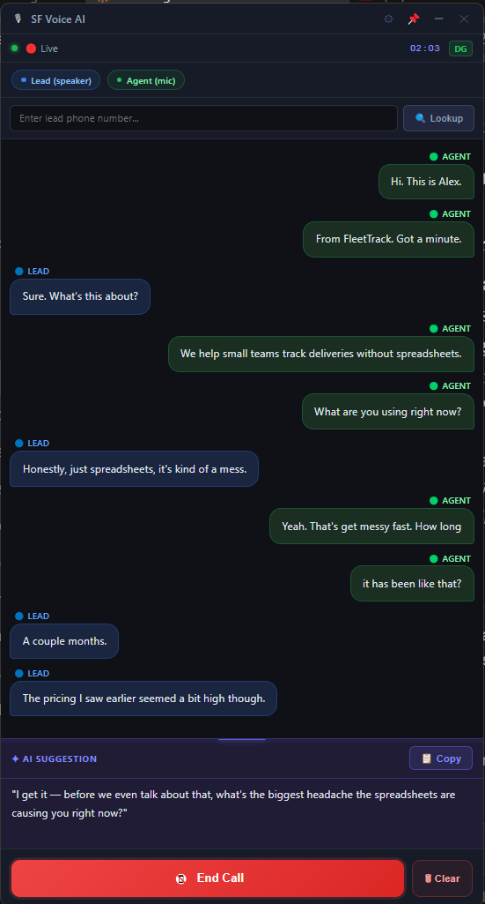
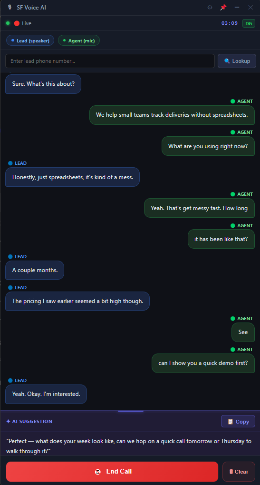
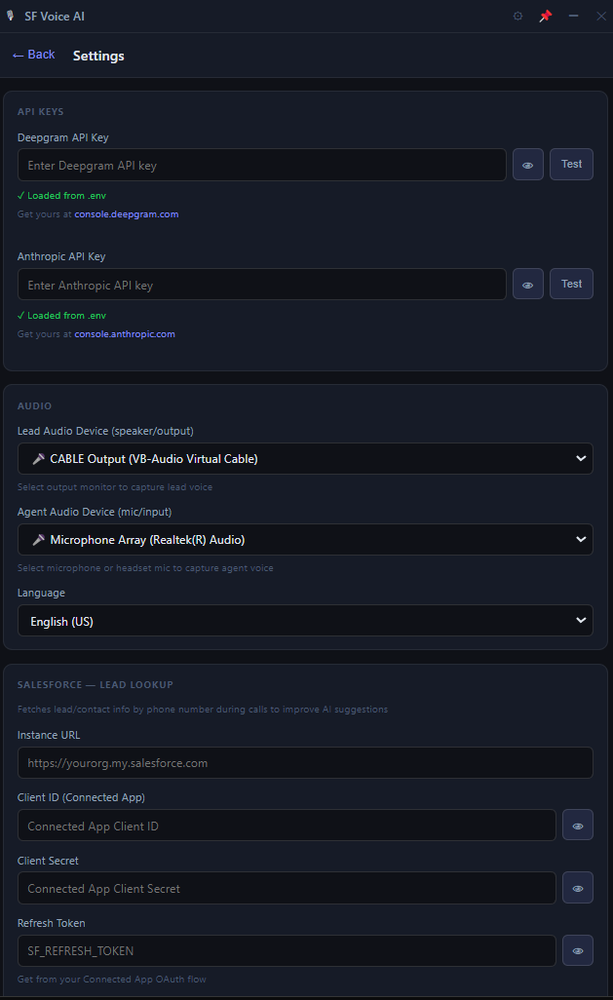
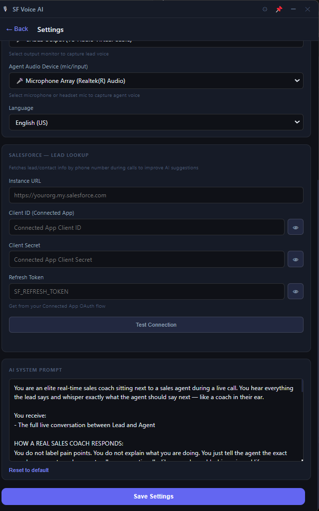

# SF Voice AI

Real-time AI sales assistant for Salesforce calls.
Captures call audio → Deepgram STT → Claude AI → live suggestions for the agent.

## Screenshots









---

## How it works

```
Lead speaks (through speaker/headset)
        ↓
Audio captured via FFmpeg
        ↓
Deepgram transcribes in real time (~300ms)
        ↓
Claude AI generates suggestion after each lead sentence
        ↓
Agent sees suggestion in UI instantly
```

---

## Supported platforms

| Platform | Status | Audio tool needed |
|----------|--------|------------------|
| Linux (Ubuntu) | ✓ Tested | PulseAudio (built-in) |
| Windows 10/11  | ✓ Supported | VB-Audio Cable (free) |
| macOS          | ✓ Supported | BlackHole (free) |

---

## Quick start

### Linux
```bash
sudo apt install ffmpeg
npm install
npm start
```

### Windows
See [WINDOWS_SETUP.md](WINDOWS_SETUP.md)
```cmd
npm install
npm start
```

### Mac
```bash
brew install ffmpeg
# Install BlackHole: https://github.com/ExistentialAudio/BlackHole
npm install
npm start
```

---

## API Keys required

| Key | Get from |
|-----|----------|
| Deepgram | console.deepgram.com |
| Anthropic | console.anthropic.com |

Add to `.env` file (copy from `.env.example`) or enter in app Settings.

---

## Build installers

```bash
npm run build:linux   # .deb + AppImage
npm run build:win     # .exe (run on Windows)
npm run build:mac     # .dmg (run on Mac)
```

---

## Project structure

```
sf-voice-ai/
├── main.js              # Electron main process
├── preload.js           # IPC bridge
├── services/
│   ├── audioCapture.js  # FFmpeg audio capture (all platforms)
│   ├── deepgram.js      # Speech-to-text
│   ├── claude.js        # LLM suggestions
│   └── salesforce.js    # Lead lookup by phone
├── renderer/
│   ├── index.html       # UI
│   ├── css/styles.css
│   └── js/app.js
└── .env.example
```